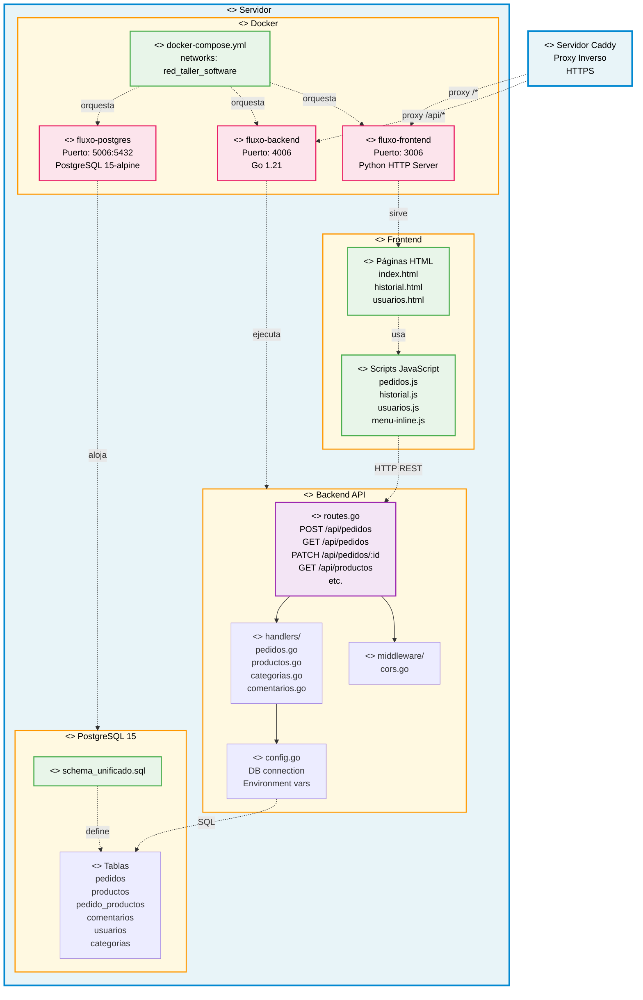
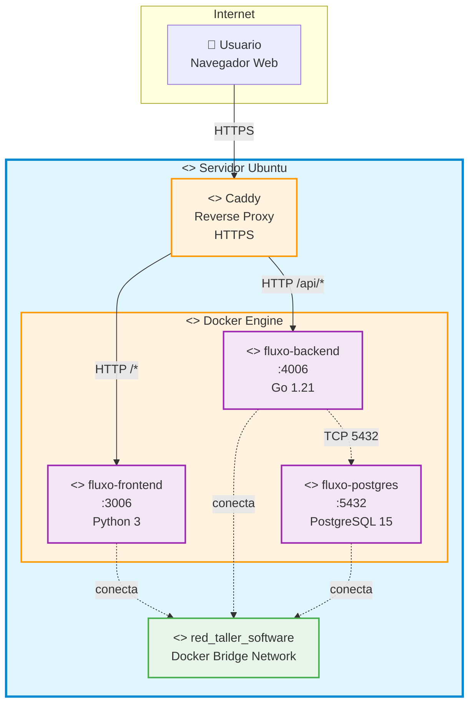
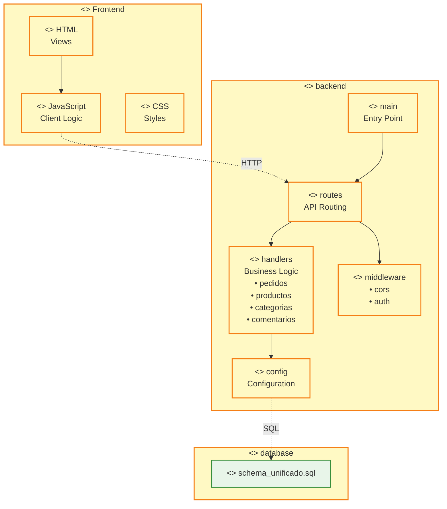

# Diagrama de Componentes UML - Sistema Fluxo

## Notación UML Estándar

---

## 📋 Leyenda de Estereotipos UML

| Estereotipo | Significado | Uso |
|-------------|-------------|-----|
| `<<node>>` | Nodo físico de hardware/servidor | Servidor Ubuntu |
| `<<component>>` | Componente de software | Frontend, Backend, BD |
| `<<artifact>>` | Artefacto físico (archivo) | HTML, JS, SQL, docker-compose |
| `<<interface>>` | Interfaz de comunicación | API REST endpoints |
| `<<execution environment>>` | Entorno de ejecución | Docker |
| `<<container>>` | Contenedor Docker | fluxo-frontend, backend, postgres |
| `<<database>>` | Base de datos | Tablas PostgreSQL |

---

## 🔗 Tipos de Relaciones

| Relación | Notación | Significado |
|----------|----------|-------------|
| **Dependencia** | `-.usa.->` | Un componente usa otro |
| **Comunicación** | `-.HTTP REST.->` | Protocolo de comunicación |
| **Asociación** | `-->` | Relación directa |
| **Despliegue** | `-.ejecuta.->` | Contenedor ejecuta componente |

---

## 📐 Diagrama de Despliegue UML (Vista Física)

---

## 🏗️ Diagrama de Paquetes UML (Estructura de Código)

---

## 📝 Notas sobre la Notación UML

### Estereotipos utilizados:
- **`<<node>>`**: Representa hardware físico (servidor)
- **`<<component>>`**: Módulos de software independientes
- **`<<artifact>>`**: Archivos físicos del sistema
- **`<<interface>>`**: Puntos de acceso/API
- **`<<execution environment>>`**: Entornos de ejecución (Docker)
- **`<<container>>`**: Contenedores Docker
- **`<<database>>`**: Bases de datos
- **`<<device>>`**: Dispositivos físicos
- **`<<network>>`**: Redes
- **`<<package>>`**: Agrupación lógica de código

### Tipos de flechas UML:
- **Línea continua (`-->`)**: Asociación/Dependencia fuerte
- **Línea punteada (`-.->`)**: Dependencia débil/Uso
- **Texto en flecha**: Protocolo o método de comunicación

### Colores por tipo (para facilitar lectura):
- **Azul**: Nodos físicos (hardware)
- **Naranja**: Componentes y entornos de ejecución
- **Verde**: Artefactos y bases de datos
- **Morado**: Interfaces y contenedores
- **Amarillo**: Paquetes de código

---

## 🎯 Diferencias con el diagrama anterior

| Aspecto | Diagrama Anterior | Diagrama UML |
|---------|-------------------|--------------|
| **Notación** | Personalizada | UML estándar |
| **Estereotipos** | ❌ No | ✅ Sí (`<<component>>`, etc.) |
| **Propósito** | Navegación de código | Documentación arquitectónica |
| **Colores** | Decorativos | Significado semántico |
| **Flechas** | Simples | Tipadas (dependencia, uso, etc.) |
| **Estándar** | Informal | IEEE/OMG UML 2.5 |

Este diagrama UML es apropiado para documentación académica y profesional. 📚
