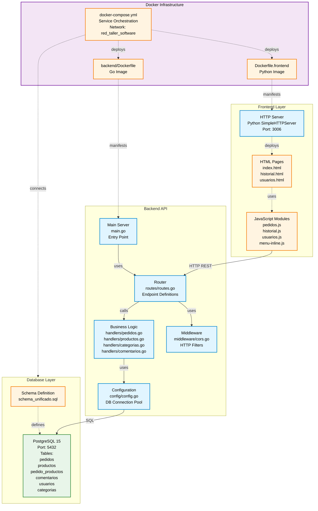

# Diagrama de Componentes UML - Sistema Fluxo

## Diagrama de Componentes (UML 2.5)



### Leyenda de Estereotipos UML

| Estereotipo | Significado | Ejemplo |
|-------------|-------------|---------|
| component | Unidad modular de software con interfaces bien definidas | Backend API, HTTP Server |
| artifact | Archivo fisico o recurso desplegable | HTML, JS, SQL, Dockerfile |
| database | Sistema de gestion de base de datos | PostgreSQL 15 |
| execution environment | Entorno de ejecucion para componentes | Docker Infrastructure |

### Tipos de Relaciones

| Relacion | Notacion | Significado |
|----------|----------|-------------|
| Dependency | uses | Componente A depende de Componente B |
| Communication | HTTP REST, SQL | Comunicacion mediante protocolo especifico |
| Deployment | deploys | Artefacto despliega componente |
| Definition | defines | Artefacto define estructura |

---

## Guia Rapida de Navegacion

### Para AGREGAR funcionalidad nueva:

| Que agregar | Donde ir | Que hacer |
|-------------|----------|-----------|
| Nuevo endpoint API | backend/routes/routes.go + backend/handlers/ | 1. Crear archivo nuevo.go en handlers/<br>2. Definir funcion handler<br>3. Registrar ruta en routes.go |
| Nueva pagina web | Frontend/ | 1. Crear nueva.html<br>2. Crear nueva.js con logica<br>3. Agregar link en menu-inline.js |
| Nueva tabla BD | schema_unificado.sql | 1. Agregar CREATE TABLE<br>2. Rebuild: docker-compose down -v && up -d |
| Nueva columna | schema_unificado.sql | 1. Agregar columna en tabla<br>2. Rebuild container BD |

### Para ARREGLAR problemas:

| Sintoma | Archivo a revisar | Linea/Seccion |
|---------|-------------------|---------------|
| 404 Not Found | backend/routes/routes.go | Verificar ruta registrada |
| CORS blocked | backend/middleware/cors.go | Headers y metodos permitidos |
| Estado no cambia | backend/handlers/pedidos.go | Linea ~406: validTransitions |
| Column does not exist | schema_unificado.sql | Verificar schema y rebuild BD |
| Backend no conecta BD | backend/config/config.go | DB_HOST debe ser "postgres" |
| Frontend no carga | Dockerfile.frontend | Puerto 3006, logs con docker logs |
| Puerto ocupado | docker-compose.yml | Cambiar mapeo de puertos |

---

## Estructura de Archivos con Proposito

```
fluxo/
│
├── Frontend/                        <- INTERFAZ DE USUARIO
│   ├── index.html                   -> Pagina principal (gestion pedidos)
│   ├── historial.html               -> Vista completa + filtros + calendario
│   ├── usuarios.html                -> Administracion de usuarios
│   ├── pedidos.js                   -> Logica: crear/editar/listar pedidos
│   ├── historial.js                 -> Logica: busqueda y filtros avanzados
│   ├── usuarios.js                  -> Logica: CRUD usuarios
│   └── menu-inline.js               -> Menu de navegacion
│
├── backend/                         <- API REST EN GO
│   ├── main.go                      -> Entry point (inicia servidor)
│   │
│   ├── routes/
│   │   └── routes.go                -> AGREGAR RUTAS AQUI (endpoints)
│   │
│   ├── handlers/
│   │   ├── pedidos.go               -> LOGICA DE PEDIDOS (estados, reactivacion)
│   │   ├── productos.go             -> CRUD productos (temporales y permanentes)
│   │   ├── categorias.go            -> CRUD categorias
│   │   └── comentarios.go           -> Add/Update/Delete comentarios
│   │
│   ├── config/
│   │   └── config.go                -> Conexion DB + variables entorno
│   │
│   ├── middleware/
│   │   └── cors.go                  -> Configuracion CORS
│   │
│   └── Dockerfile                   -> Imagen Go + wait-for-postgres script
│
├── schema_unificado.sql             -> ESTRUCTURA COMPLETA DE BD
│
├── docker-compose.yml               -> ORQUESTACION (puertos, env vars, red)
├── Dockerfile.frontend              -> Imagen Python HTTP Server
│
└── README.md                        -> Manual DevOps
```

---

## Estados de Pedidos (Maquina de Estados)

Archivo: backend/handlers/pedidos.go - Funcion ActualizarEstadoPedido() - Linea ~406

| Estado Actual | Transiciones Permitidas | Accion |
|---------------|-------------------------|--------|
| Pendiente | -> Listo<br>-> Cancelado | Preparar pedido<br>Cancelar pedido |
| Listo | -> Entregado<br>-> Cancelado | Entregar al cliente<br>Cancelar pedido |
| Cancelado | -> Pendiente | Reactivar pedido (historial.html) |
| Entregado | (Estado final) | No se puede cambiar |

Codigo clave en pedidos.go:
```go
validTransitions := map[string]map[string]bool{
    "Pendiente":  {"Listo": true, "Cancelado": true},
    "Listo":      {"Entregado": true, "Cancelado": true},
    "Entregado":  {},  // Estado final
    "Cancelado":  {"Pendiente": true},  // Reactivacion
}
```

---

## Configuracion de Red y Puertos

Archivo: docker-compose.yml

### Red Docker:
- Nombre: red_taller_software (red externa compartida con Caddy)
- Driver: bridge

### Mapeo de Puertos:

| Servicio | Puerto Externo | Puerto Interno | Acceso |
|----------|----------------|----------------|--------|
| Frontend | 3006 | 3006 | http://servidor:3006 |
| Backend | 4006 | 4006 | Proxy: /api/* -> http://localhost:4006 |
| PostgreSQL | 5006 | 5432 | Solo interno (desde backend) |

### Variables de Entorno Criticas:

```yaml
backend:
  environment:
    DB_HOST: postgres         # Nombre del servicio (NO localhost)
    DB_PORT: 5432            # Puerto interno
    DB_NAME: fluxo
    DB_USER: postgres
    DB_PASSWORD: postgres123
    PORT: 4006               # Puerto del backend
```

---

## Ejemplos Practicos

### Ejemplo 1: Agregar endpoint para "Reportes"

Paso 1: Crear backend/handlers/reportes.go
```go
func GenerarReporte(c *gin.Context) {
    // Logica del reporte
    c.JSON(200, gin.H{"data": "reporte"})
}
```

Paso 2: Registrar en backend/routes/routes.go
```go
api.GET("/reportes", handlers.GenerarReporte)
```

Paso 3: Llamar desde Frontend/reportes.js
```javascript
fetch('/api/reportes')
    .then(res => res.json())
    .then(data => console.log(data));
```

---

### Ejemplo 2: Agregar columna "prioridad" a pedidos

Paso 1: Editar schema_unificado.sql
```sql
ALTER TABLE pedidos ADD COLUMN prioridad VARCHAR(20) DEFAULT 'Normal';
```

Paso 2: Rebuild database
```bash
docker-compose down -v
docker-compose up -d --build
```

Paso 3: Actualizar backend/handlers/pedidos.go para usar la nueva columna

---

### Ejemplo 3: Arreglar error CORS

Sintoma: Access to fetch blocked by CORS policy

Solucion: Editar backend/middleware/cors.go
```go
c.Writer.Header().Set("Access-Control-Allow-Methods", "GET, POST, PATCH, DELETE, OPTIONS")
c.Writer.Header().Set("Access-Control-Allow-Headers", "Content-Type, Authorization")
```

